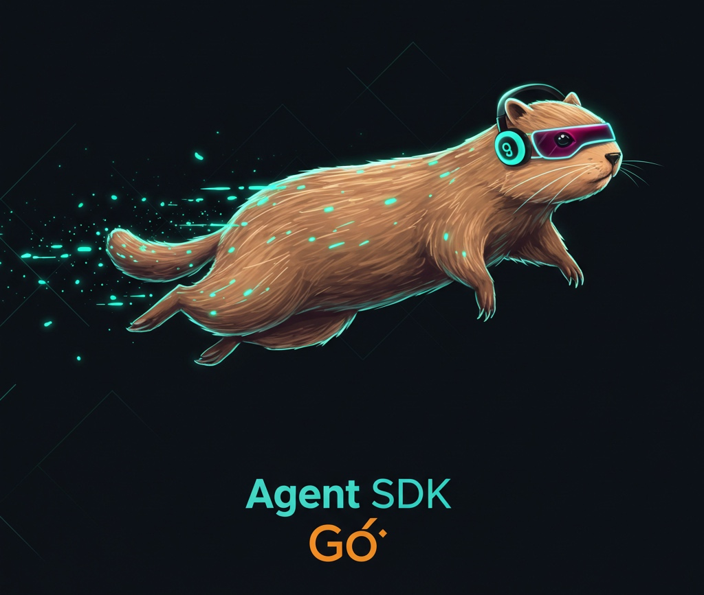

<p align="center">
  
</p>

<p align="center">
  <!-- Code Quality -->
  <a href="https://github.com/pontus-devoteam/agent-sdk-go/actions/workflows/code-quality.yml">
    
  </a>
  <!-- Go Report Card -->
  <a href="https://goreportcard.com/report/github.com/pontus-devoteam/agent-sdk-go">
    
  </a>
  <!-- Go Version -->
  <a href="https://github.com/pontus-devoteam/agent-sdk-go/blob/main/go.mod">
    
  </a>
  <!-- GoDoc -->
  <a href="https://pkg.go.dev/github.com/pontus-devoteam/agent-sdk-go">
    
  </a>
  <!-- CodeQL -->
  <a href="https://github.com/pontus-devoteam/agent-sdk-go/actions/workflows/codeql-analysis.yml">
    
  </a>
  <!-- License -->
  <a href="https://github.com/pontus-devoteam/agent-sdk-go/blob/main/LICENSE">
    
  </a>
  <!-- Stars -->
  <a href="https://github.com/pontus-devoteam/agent-sdk-go/stargazers">
    
  </a>
  <!-- Contributors -->
  <a href="https://github.com/pontus-devoteam/agent-sdk-go/graphs/contributors">
    
  </a>
  <!-- Last Commit -->
  <a href="https://github.com/pontus-devoteam/agent-sdk-go/commits/main">
    
  </a>
</p>

A Go implementation of an Agent SDK for building AI agents with support for multiple LLM providers, starting with LM Studio for local LLM integration. This project was inspired by [OpenAI's Assistants API](https://platform.openai.com/docs/assistants/overview) and [OpenAI's Python Agent SDK](https://github.com/openai/openai-agents-py).

## Overview

Agent SDK Go provides a framework for building AI agents that can use tools, perform handoffs to other agents, and produce structured output. It's designed to be flexible, extensible, and easy to use.

Key features:
- Support for multiple LLM providers (starting with LM Studio)
- Function calling with Go functions
- Agent handoffs for complex workflows
- Structured output using Go structs
- Streaming responses
- Input and output guardrails
- Tracing and monitoring
- OpenAI-compatible tool definitions

## Installation

```bash
go get github.com/pontus-devoteam/agent-sdk-go
```

## Quick Start

```go
package main

import (
    "context"
    "fmt"
    "log"

    "github.com/pontus-devoteam/agent-sdk-go/pkg/agent"
    "github.com/pontus-devoteam/agent-sdk-go/pkg/model/providers/lmstudio"
    "github.com/pontus-devoteam/agent-sdk-go/pkg/runner"
    "github.com/pontus-devoteam/agent-sdk-go/pkg/tool"
)

func main() {
    // Create a provider for LM Studio
    provider := lmstudio.NewProvider()
    provider.SetBaseURL("http://localhost:1234/v1")
    provider.SetDefaultModel("gemma-3-4b-it") // Replace with your local model

    // Create a function tool
    getWeather := tool.NewFunctionTool(
        "get_weather",
        "Get the weather for a city",
        func(ctx context.Context, params map[string]interface{}) (interface{}, error) {
            city := params["city"].(string)
            return fmt.Sprintf("The weather in %s is sunny.", city), nil
        },
    )

    // Create an agent
    assistant := agent.NewAgent("Assistant")
    assistant.SetModelProvider(provider)
    assistant.WithModel("gemma-3-4b-it")
    assistant.SetSystemInstructions("You are a helpful assistant.")
    assistant.WithTools(getWeather)

    // Create a runner
    runner := runner.NewRunner()
    runner.WithDefaultProvider(provider)

    // Run the agent
    result, err := runner.RunSync(assistant, &runner.RunOptions{
        Input: "What's the weather in Tokyo?",
    })
    if err != nil {
        log.Fatalf("Error running agent: %v", err)
    }

    // Print the result
    fmt.Println(result.FinalOutput)
}
```

## LM Studio Setup

To use the LM Studio provider:

1. **Install LM Studio**
   - Download from [lmstudio.ai](https://lmstudio.ai/)
   - Install and run the application

2. **Load a Model**
   - Download a model in LM Studio (Like Gemma-3-4B-It, Llama3, or other compatible models)
   - Load the model

3. **Start the Server**
   - Go to the "Local Server" tab
   - Click "Start Server"
   - Note the server URL (default: http://localhost:1234)

4. **Configure the Provider**
   ```go
   provider := lmstudio.NewProvider()
   provider.SetBaseURL("http://localhost:1234/v1")
   provider.SetDefaultModel("gemma-3-4b-it") // Replace with your model
   ```

## Key Components

### Agent

The Agent is the core component that encapsulates the LLM with instructions, tools, and other configuration.

```go
// Create a new agent
agent := agent.NewAgent("Assistant")
agent.SetSystemInstructions("You are a helpful assistant.")
agent.WithModel("gemma-3-4b-it")
agent.WithTools(tool1, tool2) // You can add multiple tools at once
```

You can add tools individually or pass multiple tools at once:

```go
// Add one tool at a time
agent.WithTools(weatherTool)
agent.WithTools(calculatorTool)

// Or add multiple tools in a single call (recommended)
agent.WithTools(weatherTool, calculatorTool, timeTool, translateTool)
```

### Runner

The Runner executes agents, handling the agent loop, tool calls, and handoffs.

```go
// Create a runner
runner := runner.NewRunner()
runner.WithDefaultProvider(provider)

// Run the agent
result, err := runner.Run(context.Background(), agent, &runner.RunOptions{
    Input: "Hello, world!",
})
```

### Tools

Tools allow agents to perform actions.

```go
// Create a function tool
tool := tool.NewFunctionTool(
    "get_weather",
    "Get the weather for a city",
    func(ctx context.Context, params map[string]interface{}) (interface{}, error) {
        city := params["city"].(string)
        return fmt.Sprintf("The weather in %s is sunny.", city), nil
    },
).WithSchema(map[string]interface{}{
    "type": "object",
    "properties": map[string]interface{}{
        "city": map[string]interface{}{
            "type": "string",
            "description": "The city to get weather for",
        },
    },
    "required": []string{"city"},
})
```

### Model Providers

Model providers allow you to use different LLM providers.

```go
// Create a provider for LM Studio
provider := lmstudio.NewProvider()
provider.SetBaseURL("http://localhost:1234/v1")
provider.SetDefaultModel("gemma-3-4b-it")

// Set as the default provider
runner := runner.NewRunner()
runner.WithDefaultProvider(provider)
```

## Advanced Features

### Multi-Agent Workflows

The SDK supports creating multi-agent systems where agents can handoff tasks to specialized agents:

```go
// Create specialized agents
mathAgent := agent.NewAgent("Math Agent")
mathAgent.SetSystemInstructions("You are a specialized math agent.")
mathAgent.WithTools(calculatorTool)

weatherAgent := agent.NewAgent("Weather Agent")
weatherAgent.SetSystemInstructions("You provide weather information.")
weatherAgent.WithTools(weatherTool)

// Create a frontend agent that coordinates tasks
frontendAgent := agent.NewAgent("Frontend Agent")
frontendAgent.SetSystemInstructions(`You coordinate requests by delegating to specialized agents.
For math calculations, delegate to the Math Agent.
For weather information, delegate to the Weather Agent.`)
frontendAgent.WithHandoffs(mathAgent, weatherAgent)

// Run the frontend agent
result, err := runner.Run(context.Background(), frontendAgent, &runner.RunOptions{
    Input: "What is 42 divided by 6 and what's the weather in Paris?",
})
```

### Tracing

Enable tracing to debug and monitor your agents:

```go
// Run with tracing enabled
result, err := runner.Run(context.Background(), agent, &runner.RunOptions{
    Input: "Hello, world!",
    RunConfig: &runner.RunConfig{
        TracingDisabled: false,
        TracingConfig: &runner.TracingConfig{
            WorkflowName: "my_workflow",
        },
    },
})
```

### Structured Output

```go
// Define an output type
type WeatherReport struct {
    City        string  `json:"city"`
    Temperature float64 `json:"temperature"`
    Condition   string  `json:"condition"`
}

// Create an agent with structured output
agent := agent.NewAgent("Weather Agent")
agent.SetSystemInstructions("You provide weather reports")
agent.SetOutputType(reflect.TypeOf(WeatherReport{}))
```

### Streaming

```go
// Run the agent with streaming
streamedResult, err := runner.RunStreaming(context.Background(), agent, &runner.RunOptions{
    Input: "Hello, world!",
})
if err != nil {
    log.Fatalf("Error running agent: %v", err)
}

// Process streaming events
for event := range streamedResult.Stream {
    // Handle event
    switch event.Type {
    case model.StreamEventTypeContent:
        fmt.Print(event.Content)
    case model.StreamEventTypeToolCall:
        fmt.Printf("\nCalling tool: %s\n", event.ToolCall.Name)
    case model.StreamEventTypeDone:
        fmt.Println("\nDone!")
    }
}
```

## OpenAI Tool Definitions

The SDK provides utilities for working with OpenAI-compatible tool definitions:

```go
// Auto-generate OpenAI-compatible tool definitions from Go functions
func main() {
    // Create a tool from a Go function
    getCurrentTimeTool := tool.NewFunctionTool(
        "get_current_time",
        "Get the current time in a specified format",
        func(ctx context.Context, params map[string]interface{}) (interface{}, error) {
            // Tool implementation
            return time.Now().Format(time.RFC3339), nil
        },
    )
    
    // Convert it to OpenAI format - this is handled automatically
    // when tools are added to the agent, but you can also do it manually:
    openAITool := tool.ToOpenAITool(getCurrentTimeTool)
    
    // Now you can use this schema elsewhere (e.g., in an OpenAI API call)
    // or pass it to other systems that expect OpenAI-compatible tool definitions
    
    // You can also add an OpenAI-compatible tool definition directly to an agent:
    agent := agent.NewAgent("My Agent")
    agent.AddToolFromDefinition(openAITool)
    
    // You can also add multiple tool definitions at once:
    toolDefinitions := []map[string]interface{}{
        tool.ToOpenAITool(tool1),
        tool.ToOpenAITool(tool2),
    }
    
    agent.AddToolsFromDefinitions(toolDefinitions)
}
```

This makes it easy to share tool definitions between this SDK and other OpenAI API integrations.

## Documentation

For more detailed documentation, see the [docs](./docs) directory.

## Examples

For examples, see the [examples](./cmd/examples) directory.

## Development

### Requirements

- Go 1.23 or later

### Setup

1. Clone the repository
2. Run the setup script to install required tools:

```bash
./scripts/ci_setup.sh
```

### Development Workflow

The project includes several scripts to help with development:

- `./scripts/lint.sh`: Runs formatting and linting checks
- `./scripts/security_check.sh`: Runs security checks with gosec
- `./scripts/check_all.sh`: Runs all checks including tests
- `./scripts/version.sh`: Helps with versioning (run with `bump` argument to bump version)

### Running Tests

Tests are located in the `test` directory and can be run with:

```bash
cd test && make test
```

Or use the check_all script to run all checks including tests:

```bash
./scripts/check_all.sh
```

### CI/CD

The project uses GitHub Actions for CI/CD. The workflow is defined in `.github/workflows/ci.yml` and includes:

- Linting
- Security checks
- Building
- Testing

## Contributing

Contributions are welcome! Please see [CONTRIBUTING.md](./CONTRIBUTING.md) for details.

## License

This project is licensed under the MIT License - see the [LICENSE](https://github.com/pontus-devoteam/agent-sdk-go/blob/main/LICENSE) file for details.

## Acknowledgements

This project is inspired by [OpenAI's Assistants API](https://platform.openai.com/docs/assistants/overview) and [OpenAI's Python Agent SDK](https://github.com/openai/openai-agents-py), with the goal of providing similar capabilities in Go while being compatible with local LLMs. 